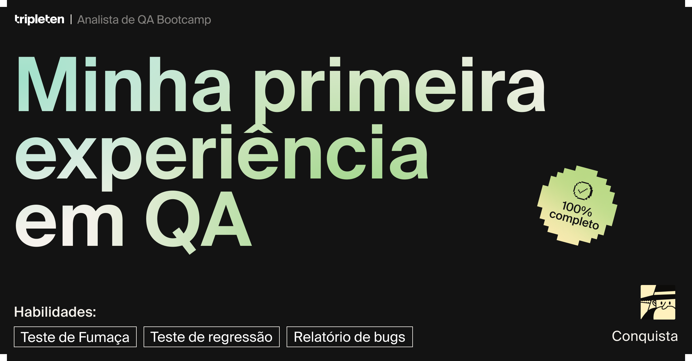

# 🧪 Urban Routes — QA Sprint 1

Projeto desenvolvido durante o Bootcamp de Analista de QA da TripleTen.

Neste projeto, realizei testes no aplicativo web **Urban Routes**, colocando em prática conceitos fundamentais de Quality Assurance e documentação de testes.

## 🎯 Objetivo do projeto

Validar funcionalidades do Urban Routes por meio da execução de casos de teste, identificando comportamentos incorretos e documentando os resultados encontrados.

## 🔎 Atividades realizadas

- Execução de casos de teste
- Teste de fumaça (Smoke Testing)
- Teste de regressão
- Validação de funcionalidades da interface
- Comparação entre resultado esperado e resultado obtido
- Identificação de falhas
- Documentação de bugs
- Registro do status dos testes como aprovado ou reprovado

## 🐞 Exemplos de problemas identificados

Durante a execução dos testes foram encontrados comportamentos inesperados, incluindo:

- Falha na exibição da lista de estações em determinadas pesquisas.
- Problemas relacionados à busca e preenchimento de endereços.
- Elementos da interface que não apresentavam o comportamento esperado.
- Elemento de navegação do Urban Routes sem resposta ao clique.

## 🛠️ Habilidades aplicadas

- Testes manuais
- Smoke Testing
- Regression Testing
- Test Cases
- Bug Reporting
- Análise de requisitos
- Validação de interface
- Documentação de testes

## 📚 Formação

Projeto realizado durante o **Bootcamp de Analista de QA — TripleTen**.

A conclusão desta etapa envolveu a aplicação prática de:

✅ Teste de Fumaça  
✅ Teste de Regressão  
✅ Relatório de Bugs  

## 📈 Aprendizados

Este projeto proporcionou experiência prática na execução de testes de software, análise de resultados e identificação e documentação de defeitos.

Também permitiu desenvolver uma visão mais estruturada do processo de Quality Assurance, desde a análise do comportamento esperado até o registro dos resultados encontrados.

## 🏆 Conclusão do projeto

Projeto concluído com **100% de progresso** no Bootcamp de Analista de QA da TripleTen.

Nesta etapa, foram desenvolvidas e aplicadas habilidades em:

- Teste de Fumaça (Smoke Testing)
- Teste de Regressão (Regression Testing)
- Relatório de Bugs (Bug Reporting)

### Evidência de conclusão

---

**Autor:** Vinicius Sergio Alencar  
**Área:** Quality Assurance (QA)
